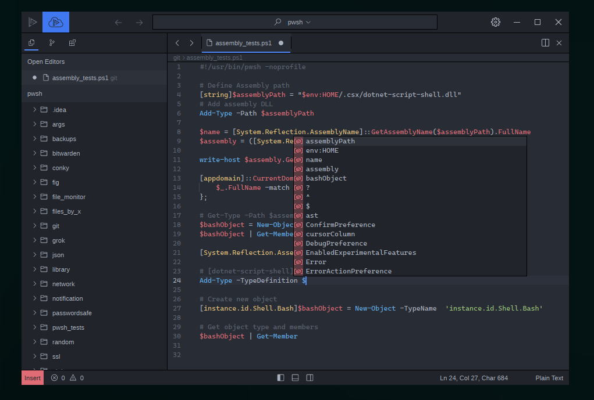

### Lapce - PowerShell Language Server Plugin

In development, very basics are working (syntax highlighting, hover details of types, etc), but there are some bugs.

! Currently Only Tested On Linux !

Immediately noticed:
* Pwsh process does not exit when the extension is deactivated/Lapce is closed, so you have to kill it manually.
* The current line number sent to the LSP is sometimes out of range, causing syntax highlighting to be off.

